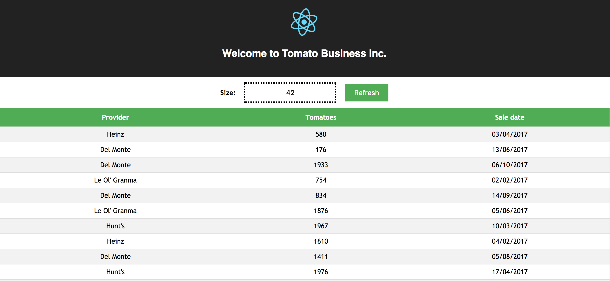

# tomato-business-kt
Rework original tomato-business in kotlin

Steps to run:
+ Build && run backend app - `cd tomato-backend && gradle bootRun`  
+ Build && run frontend app - `cd tomato-frontend && npm install && npm start`

Open [App page](http://localhost:3000) here u go! 

